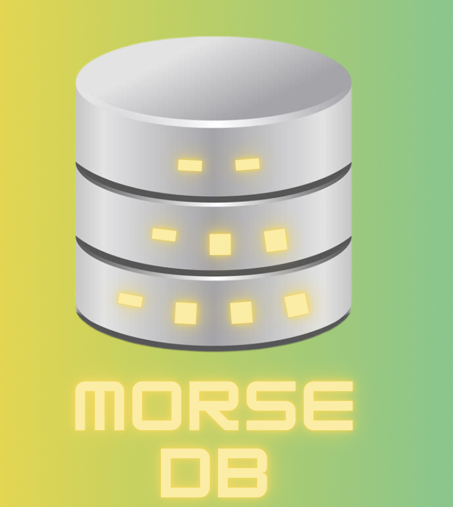

# MorseDB

## Basic Description
This product is a relational database with morse code syntax and is run using C#.

## How to Use
- Fork this Repl
- Edit database.morse
- •--••-•• = add (stores key-value pairs, place the two key and value parameters next to it)
- •••••••---•-- = show (displays key-value pairs, requires no parameters)
- Run the program

## Processing of database.morse code
The program first retrieves the database code using the following code, which uses namespace System.IO.

~~~csharp
var get_database = new StreamReader("database.morse"); // gets the contents of database.morse

var database = get_database.ReadToEnd(); // saves contents of file to a variable
~~~

The .morse code is split into individual "tokens" (like words in a sentence), and the tokens are looped over individually. If the program detects the add keyword, an index is created and a boolean variable is set to true. 

These are used to activate the next two pathways of the loop, which store the key and value. Finally, if the program detects the show keyword, the program displays both the key and value to the user.

## Notes
In order for the code to work properly, the user must put all of the database.morse code on one line.

